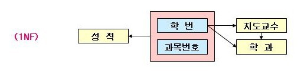
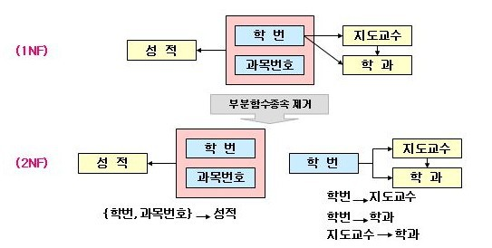

# Database
수업 내용과 구글링 정보를 참고하여 작성하였습니다. 삽입한 그림은 현재는 모두 다른 웹사이트에서 불러왔으며 출처는 적지 않았으나 추후에 출처를 기입하거나 직접 그림을 올릴 예정입니다.

예상 문제 접기/펼치기

1. DB란? DBMS란? RDBMS란? 
&nbsp; &nbsp;1-1. DB의 특징 
&nbsp; &nbsp;1-2. Schema란 
&nbsp; &nbsp;1-3. DBMS 사용 언어 
&nbsp; &nbsp;1-4. Connection Pool이란? 
&nbsp; &nbsp;1-5. View란? 
2. 인덱스란?
&nbsp; &nbsp;2-1. 인덱스 사용 자료구조 
&nbsp; &nbsp;2-2. b+ 트리의 장점 
3. 정규화란?
&nbsp; &nbsp;3-1. 장점과 단점 
&nbsp; &nbsp;3-2. 1NF, 2NF, 3NF, BCNF 
4. 트랜젝션이란?
&nbsp; &nbsp;4-1. 사용 언어(TCL) 
&nbsp; &nbsp;4-2. ACID 
&nbsp; &nbsp;4-3. 트랜젝션 시 발생 가능 문제 
&nbsp; &nbsp;4-4. 스케줄링 
&nbsp; &nbsp;4-5. Lock, 2단계 락킹 
&nbsp; &nbsp;4-6. 데드락 
&nbsp; &nbsp;4-7. 고립수준 
5. SQL vs. NoSQL 
&nbsp; &nbsp;5-1. SQL 언어 
&nbsp; &nbsp;5-2. NoSQL의 특징 

*SQL, NoSQL 관련 자료 추후 추가 예정*
  

## 목차
[데이터베이스란?](#데이터베이스란?) 
[Index](#Index) 
[정규화](#정규화) 
[트랜젝션](#트랜젝션) 
  

## 데이터베이스란?
특정 업무를 수행할 때 필요한 large dataset

**특징**
* **독립성**
  * 물리적 독립성: DB 사이즈 변경 및 성능 향상을 위해 변화가 생겨도 관련 응용프로그램 사용에 전혀 문제가 생기지 않음
  * 논리적 독립성: 내부 스키마에 변화가 생겨도 외부 스키마에 영향 없이 여전히 논리적 요구를 충족함
* **무결성(일관성):** 관련 DB 모델에서 데이터에 일관성이 있음 (삭제/수정 시 모든 관련 테이블에 영향)

**Key:** 다른 Tuple들과 구분할 수 있는 속성
* **Primary Key:** 객체의 속성 중 모든 튜플이 각기 다른 값을 가져 구분할 수 있는 key
  * e.g.) 주민등록번호
  * 특징
    * Null 값을 가질 수 없음
    * 항상 고유값을 가짐
    * 변경이 없어야함
    * 테이블 별로 하나만 존재
* **Alternative Key:** PK대신 대체 가능한 속성을 가진 key
* **Candidate Key:** Primary Key + Alternative Key
  * 특징: 유일성, 최소성
* **Composite Key:** 하나의 속성 만으로는 Cadidate Key 속성에 적합하지 않은 경우, 두개의 속성을 병합해서 key 만들 수 있음
* **Super Key:** Candidate Key가 될 수 있는 모든 Composite key
  * 특징: 유일성은 만족하지만 최소성을 만족하지 못함
* **Foreign Key:** 다른 Relation에서 가져와서 사용하는 Key

### DBMS(Database Management System)
데이터베이스를 저장 및 관리하는 시스템이며 방대한 데이터를 정리하여 사용자의 access를 용이하게 해줌 (e.g. MySQL, Oracle)
 
**Data Models:** 데이터에 대한 설명
* **Relation:** 데이터간의 상호 관계
* **Schema:** 특정 data collection을 지칭하며 각 스키마는 독립성을 가짐
  * 외부 스키마: 논리적 구조를 정의 (사용자의 관점)
  * 개념 스키마: 데이터 통합 스키마이며 DB 관리자에 의해 결정됨 (모든 사용자에게 보이는 데이터)
  * 내부 스키마: 물리적 구조를 정의 (Files/Indexes 저장 방법)

**사용 언어**
* **DDL(Data Definition Language, 데이터 정의어):** 테이블 관련 명령어
  * DB 구축이나 수정에 사용되고, 파일에 여러개의 테이블로 저장됨
  * 논리적 데이터와 물리적 데이터 구조의 정의 및 수정 가능
  * 데이터의 물리적 순서 정의
  * e.g. CREATE, DROP, ALTER, RENAME
* **DML(Data Manipulation Language, 데이터 조작어):** 테이블 내부 데이터 조작
  * 응용프로그램과 DBMS간의 인터페이스에 필요한 언어
  * 사용자가 DB에 접근하여 데이터 저장, 변형, 확인과 같은 조작을 함
  * e.g. SELECT, UPDATE, INSERT, DELETE
* **DCL(Data Control Language, 데이터 제어어):** 데이터 접근을 제어
  * e.g. GRANT(사용자에게 데이터 접근 권한 부여), REVOKE(권한 무효화)
* **TCL(Transaction Control Language, [트랜젝션](#트랜젝션) 제어어):** 정확한 데이터 제어를 위한 명령어
  * e.g. COMMIT(트랜젝션 결과 반영), ROLLBACK(결과 취소/복구), SAVEPOINT(중간 결과 저장)

**Connection Pool:** DB와 미리 connect 해놓은 객체들을 **pool(웅덩이)** 에 저장해두었다가 client 요청에 따라 빌려주고 다시 반납받아 pool에 저장
* **과정**
  1. Client가 게시글을 Server로 전송
  2. Logic 처리
  3. Connect 되어있는 Pool로부터 DB 빌림
  4. DB에 업데이트 후 다시 반납
  5. Logic 처리 후 Client에 응답
  * Connection pool 사용을 안하면 iii-v 과정 대신, Server가 DB와 connection을 맺은 후 DB 처리한 후 연결 해제
* 장점: 매번 연결/해제를 반복할 필요가 없어 시간 단축으로 인한 성능 향상
* 단점: 정해진 connection 수가 있기 때문에 커넥션 반납 때까지 다른 서버가 기다려야하고, 커넥션을 늘리면 메모리차지가 심해져서 오히려 성능 저하가 생길 수 있음

## Index
추가적인 쓰기 작업과 저장 공간을 활용하여 데이터베이스 테이블의 검색 속도를 향상시키기 위한 자료구조 (책의 목차와 비슷한 개념)
* Full Scan을 하게 되면 처리 속도가 떨어지기 때문에 index를 이용한 빠른 탐색 필요
* 사용하기 위해서는 [Normalization](#정규화) 꼭 필요

**인덱스 자료구조**
* **해시 테이블**
  * 컬럼값으로 생성된 해시를 기반으로 인덱스를 구현
  * 시간복잡도가 `O(1)`이라서 매우 빠름
  * 부등호와 같은 연속적인 데이터를 위한 순차 검색 불가능
  * 메모리 기반의 DB에서 사용

* **B+ Tree** 
    *B+ Tree 알고리즘 구현해보기*
   
  * 컬럼값을 변형하지 않고 원래 값을 이용해 indexing
  * 자식 노드가 2개 이상인 **B-Tree**를 개선시킨 자료구조
    * B Tree의 leaf node들을 LinkedList로 한 leaf node의 마지막 element와 그 다음 leaf 노드의 첫 element를 연결해서 순차 검색을 용이하게 함
    * B Tree와는 달리 leaf node에 모든 key가 존재해서 leaf node까지 도착해야 값을 확인할 수 있음. (삽입/삭제 모두 leaf 노드에서 이루어짐)
    * leaf node는 최소 `(ceil)(M/2)-1`개의 key를 가져야함 (`(ceil)(M/2)=t`, M=degree of tree)
    * B Tree의 경우, internal node에서 삭제하게 되면, 자식 노드의 크기를 체크하고 두 자식 모두 t보다 크거나 같으면 left child node의 최대값, 아니면 right node의 최소값을 부모노드로 이동
  * 부등호와 같은 연속적인 데이터를 위한 순차 검색 가능
  * 시간복잡도가 `O(log n)`이라서 해시테이블보다 느리지만 더 자주 사용됨
  * **삽입:** leaf node에 공간이 있으면 삽입하고 메모리 초과 시, node안 중간 값을 parent 노드로 올려서 그 기준으로 노드 분할
  * **삭제:** leaf node에서 삭제할 경우, 삭제 후 node 원소 수가 t보다 크거나 같으면 유지  t보다 작으면 형제 노드와 merge하고 merge한 결과의 크기가 M보다 크면 분할
  

## 정규화
테이블에서의 정보 중복이나 갱신 이상과 같은 문제를 해결하기 위해 단계별로 제약을 걸어두는 것이며, 정보 신뢰성과 DB 효율성에 큰 영향을 끼침

* 이상현상 해결
  * **삽입 이상:** 기본 키에 Null값이 필요하여 불필요한 데이터를 추가
  * **갱신 이상:** 중복되는 데이터의 값을 업데이트 할 경우 빠짐없이 모조리 업데이트 해야하지만 일부 바뀌지 않을 수 있음
  * **삭제 이상:** Tuple 삭제로 인해 필요한 데이터마저 삭제될 수 있음
* 장점: 한 테이블의 크기가 작아 수행이 쉬움 단점: JOIN과 같은 Relation간의 연산이 많아져 시간이 오래 걸림

### 1NF
 
**원자성**을 특징으로 가짐 (하나의 tuple에 한번에 여러 데이터의 attribute를 삽입하지 않고 따로 저장)

### 2NF
 
* 기본키가 아닌 속성이 기본키에 **완전 함수 종속**이도록 분해된 1NF
  * **완전함수종속:** PK의 부분집합이 다른 값을 결정하지 않음
* 불필요한 메모리 할당을 없애고 삭제나 데이터 업데이트 시 생길 수 있는 정합성/갱신 문제 해결 가능
* 테이블을 나누어 처리하고 PK가 복합키면 안됨

### 3NF
 
* 기본키가 아닌 속성이 기본키에 직접 종속(**비이행적 종속**)하도록 분해한다
  * **비이행적 종속:** Transitivity를 없앰

### BCNF(Boyce and Codd)
 
* 함수 종속성 X→Y가 성립할 때 모든 결정자 X가 후보키인 3NF (LHS가 항상 CK여야함)

  

## 트랜젝션
 
하나 이상의 쿼리를 처리할 때 동일한 Connection 객체를 공유하여 에러가 발생한 경우 모든 과정을 되돌리면서 DB 작업의 완전성을 보장하는 작업 단위 (일부에만 적용되는 것을 막음)

### TCL
* **COMMIT:** 트랜젝션이 정상적으로 종료되어 DB가 일관성 있는 상태를 알려주기 위한 연산
* **ROLLBACK:** 트랜젝션이 질의 수행 시, 비정상적으로 종료되어 이전에 COMMIT한 지점으로 돌아가기 위한 연산 (=`abort`)

### ACID
* **A**tomicity(원자성): 트랜젝션에 포함된 모든 명령이 함께 수행되거나 하지 않음
* **C**onsistency(일관성): 트랜젝션을 수행한 전이나 후나 데이터베이스는 항상 일관된 상태를 유지해야함
* **I**solaion(고립성): 수행 중인 트랜젝션에 대해 다른 트랜젝션이 끼어들어 변경 중인 데이터 값을 훼손하면 안됨
* **D**urability(지속성): 수행을 성공적으로 완료한 트랜젝션은 변경한 데이터를 영구히 저장해야함

### 이상 현상
여러 개의 트랜젝션 수행 시 생길 수 있는 문제 (질의어 관련 문제는 `ROLLBACK`, 시스템 관련 문제는 `RECOVERY`로 해결 가능)
* **Dirty Read:** 아직 완료되지 않은 값을 읽음
* **Lost Update:** 수정 값을 다른 트랜젝션에서 다시 수정하여 잃어버림
* **Unrepeatable Read:** 데이터가 다른 트랜젝션에서 수정되어 전에 읽은 값과 다른 값이 읽힘

### Scheduling
* **직렬 스케줄(Serial Schedule):** 각 트랜젝션이 동시에 진행되는 것이 아닌 들어온 순서대로 하나씩 시행하고, 트랙젝션 시행이 끝날 때까지 다른 트랜젝션을 수행할 수 없음
* **비직렬 스케줄(Non-serial Schedule):** 트랜젝션을 병행으로 실행
* **직렬 가능 스케줄(Serializable Schedule):** 서로 영향을 주지 않는 트랜젝션에 한해 비직렬 스케줄처럼 트랜젝션을 병행하여 수행
    * 충돌 직렬 가능성(Conflict Serializability)    
      * 충돌: 두 연산이 다른 트랜젝션에 포함되어있고 같은 자원에 접근하는 것(하나는 꼭 `write`일 때)
      * 충돌 연산의 경우, 순서에 따라 결과가 달라지므로 scheduling 꼭 필요
      * 비충돌연산의 순서를 변경해서 데이터 보존
    * 뷰 직렬 가능성(View Serializability)
      * View: 사용자가 가상의 테이블(필요 데이터만 모아둔 가상의 테이블이며, 원래 테이블의 PK가 PK이어야함)을 볼 수 있고 이로 인해 원본에는 영향을 끼치지 않음 (독립성 보장)
        * 연산을 줄여 효율성을 높이고 필요 데이터만 모아져있어 보안성 높음
      * View Equivalance: 두 트랜젝션에서 필요한 데이터만 모아 View를 생성했을 때, 각 View가 동일한 것 (T1에서 A 수정 시, T2에서도 A 수정)

### DB Lock 종류
DB락은 여러 개의 트랜젝션이 하나의 데이터에 접근하려고 할 때 이를 제어해주는 장치 (잠금을 걸어 순서대로 DB에 진입)
* **공유락(Shared Lock, LS):** 트랜젝션이 읽기를 할 때 사용함. 데이터를 읽을 수 있지만 쓸 수는 없음
* **베타락(Exclusive Lock, LX):** 트랜젝션이 읽고 쓰기를 할 때 사용하는 락.

### 2단계 락킹
락을 걸고 해제하는 시점에 제한을 두지 않으면 두 개의 트랜젝션이 동시에 실행될 때 데이터의 일관성이 깨질 수 있기 때문에 2단계로 구분하여 이를 방지
* **확장 단계(Growing Phase):** 트랜젝션은 새로운 lock연산만 가능하고 unlock 연산은 할 수 없는 단계
* **축소 단계(Shrinking Phase):** 트랜젝션은 unlock연산만 가능하고 lock 연산은 할 수 없는 단계

### 데드락
트랜젝션 A와 B가 각각 자원 a,b에 락을 걸은 상태에서 A는 b에 접근하려하고 B는 a에 접근하려고 하지만 락이 걸려있어 unlock될 때까지 기다리는 현상
* **해결 방법**
  * 트랜젝션을 자주 `COMMIT`해서 데드락이 발생하면 `ROLLBACK`을 통해 문제 지점으로 돌아가 해결
  * 일정 순서로 데이터 접근

### 고립 수준(Isolation Level)
 
트랜젝션 수행 중 이상 현상이 발생할 수 있는데 다른 트랜젝션의 접근을 제어하기 위해서 고립수준을 설정하고 발생하는 문제를 해결하도록 하는 DBMS 제공 명령어
* **`READ UNCOMMITTED`(0단계)**
  * 자신의 데이터에 아무런 공유락을 걸지 않는 단계 (처리중이거나 아직 `COMMIT`하지 않은 데이터를 다른 트랜젝션이 읽는 것을 허용)
  * Dirty Data 문제 발생 가능 (일관성 유지 불가능)
  * `SELECT`에 공유락 걸지 않음
* **`READ COMMITTED`(1단계)**
  * 수행 중에는 기다리고 `COMMIT`이 끝나야만 접근 가능 = Non-repeatable Read
  * Dirty Data 문제 발생하지 않음
  * 하나의 트랜젝션에서 같은 값을 갖는 것에서 어긋남
  * SQL 디폴트 고립 수준
* **`REPEATABLE READ`(2단계)**
  * 트랜젝션이 완료할 때 까지 `SELECT`가 사용하는 모든 데이터에 Shared-lock 걸림
    * `COMMIT` 전 결과를 읽어들임
  * 트랜젝션 내에서 동일한 데이터 보장
  * 다른 사용자는 트랜젝션 영역의 데이터 수정 불가
* **`SERIALIZABLE`(3단계)**
  * 동시성 X => 성능 저하
  