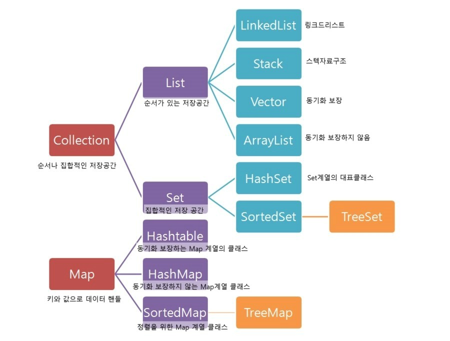

# Data Structure
수업 내용과 구글링 정보를 참고하여 작성하였습니다. 삽입한 그림은 현재는 모두 다른 웹사이트에서 불러왔으며 출처는 적지 않았으나 추후에 출처를 기입하거나 직접 그림을 올릴 예정입니다.

*HashTable vs. HashMap vs. TreeMap, List vs. Set*
  
## 목차
[자료구조란?](#자료구조란?) 
[Array, LinkedList, ArrayList](#Array,-LinkedList,-ArrayList) 
[스택, 큐, 트리, 힙](#스택,-큐,-트리,-힙) 
[List, Set, Map](#List,-Set,-Map) 
[Tree](#Tree) 
[Hash](#Hash) 
[Graph](#Graph) 
  

## 자료구조란?
*자료구조 각각의 효율성 및 장단점 파악하고 구현할 줄 아는 것이 중요*

데이터의 접근과 생성/수정/삭제를 용이하게 하는 데이터 저장 방식 및 조작 방법
 
## Array, LinkedList, ArrayList
#### Array
논리적 저장 순서와 물리적 저장 순서가 일치하는 데이터 나열 자료구조
* 선언할 때 Array 크기도 함께 선언해야함
* index를 통해 데이터 접근이 가능하여 `O(1)`의 시간복잡도를 가짐
* 삽입과 삭제에는 취약함 (중간에 삽입하거나 삭제되면 이후에 오는 모든 데이터의 위치를 변경해야함) - 시간복잡도: worst = `O(n)`
* Stack 메모리 섹션에 할당

#### Array List
Array와 같이 물리적 주소와 논리적 주소가 일치하지만 크기 변경이 가능함
* index를 통해 데이터 접근이 가능하여 `O(1)`의 시간복잡도를 가짐
* 삽입과 삭제에는 취약함 (중간에 삽입하거나 삭제되면 이후에 오는 모든 데이터의 위치를 변경해야함) - 시간복잡도: worst = `O(n)`

#### Linked List
원소들끼리 서로 연결되어 데이터를 나열한 자료구조
* 논리적 순서에 따라 데이터를 입력하지만 물리적인 주소는 순차적이지 않음
* 각 원소마다 자신의 이전 위치나 다음 위치 혹은 둘 다 기억함
* 한번에 데이터 접근이 불가능해서 연결을 따라 처음부터 탐색하는 방법밖에 없음 (시간복잡도: worst=`O(n)`)
* 삭제하거나 중간에 삽입하는 것은 배열보다 훨씬 간단함 (시간복잡도: `O(1)`)
* Tree 구조에서 자주 사용됨
* Heap 메모리 섹션에 할당
  

## 스택, 큐, 트리, 힙
#### Stack
* **LIFO(Last-In First-Out)** 의 자료구조로 마지막에 삽입한 자료를 가장 먼저 꺼냄
* **stack underflow:** 자료가 stack에 없을 때 `pop()`하면 생기는 오류  **stack overflow:** stack 크기 이상의 데이터를 삽입하려고 할 때 생기는 오류
* index를 늘리고 줄이는 과정만 있으면 되므로 Array를 사용해서 구현하는 것이 좋음
* `MAX_SIZE`가 존재해서 메모리가 가득 차면 더 큰 크기의 구역에 복제시켜 크기를 늘림
* DFS나 재귀 구현할 때 사용

#### Queue
* **FIFO(First-In First-Out** 의 자료구조로 처음에 삽입한 자료를 가장 먼저 꺼냄
* LinkedList로 구현하는 것이 삭제와 삽입에 용이함(한 쪽 끝에서는 삽입, 다른 한 쪽에서는 삭제)
* BFS나 캐시 구현할 때 사용
  

## List, Set, Map
#### List
저장공간이 필요에 의해 자동으로 늘어나는 순서가 있는 저장공간
* 순서가 있고 중복 허용 (배열과 유사)
* 장점: 배열이 자동으로 늘어남 단점: 원하는 데이터가 뒤쪽에 위치하는 경우 탐색 속도에 문제가 있음

#### Set
집합으로 순서가 없고 중복이 허용되지 않음
* 장점: **Hash Table** 을 사용하여 해쉬값을 기반으로 데이터를 해당 공간(Bucket)에 저장하기 때문에 특정 값을 확인하는 데에 속도가 빠름
* 단점: 단순 집합의 개념으로 정렬하려면 별도의 처리 필요
* 사용 상황
  * 중복 값을 골라내야할 때
  * 특정 값이 있는지 빠르게 확인해야할 때

#### Map
키와 데이터를 같이 저장해서 키를 이용하여 데이터 탐색. 키는 중복될 수 없음
* 장점: 빠른 속도
* 단점: Key의 검색 속도가 전체 속도를 좌우함