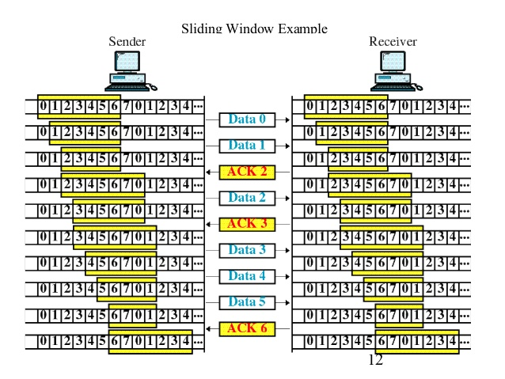
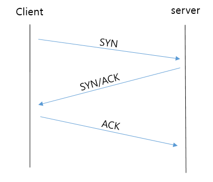
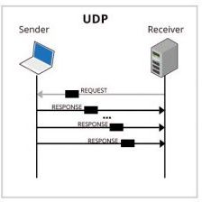
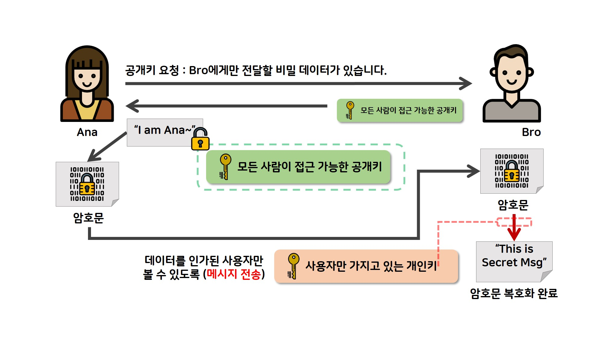

# Network
수업 내용과 구글링 정보를 참고하여 작성하였습니다. 삽입한 그림은 현재는 모두 다른 웹사이트에서 불러왔으며 출처는 적지 않았으나 추후에 출처를 기입하거나 직접 그림을 올릴 예정입니다.
  
## 목차
[네트워크 기본](#네트워크-기본) 
[OSI 7 Layers](#OSI-7-Layers)
* [Physical Layer](#Physical-Layer)
* [Data Link Layer](#Data-Link-Layer)
* [Network Layer](#Network-Layer)
* [Transport Layer](#Transport-Layer)
* [Session Layer](#Session-Layer)
* [Presentation Layer](#Presentation-Layer)
* [Application Layer](#Application-Layer)
  

## 네트워크 기본
#### 네트워크란?
이름 그대로 다른 컴퓨터들과 같은 망(Net)으로 묶여 정보 공유와 같은 작업(Work)을 진행하는 것

**네트워크 주요 범주** 
* WAN(Wide Area Network)
* LAN(Local Area Network)

**인터넷이란?** 
여러 개의 네트워크가 연결되어있는 네트워크간의 네트워크

#### 웹 동작 방식
 
1. 사용자가 브라우저에 URL 입력
2. 브라우저는 [DNS](#DNS)를 통해 서버의 IP 주소를 찾음
3. HTTP 프로토콜을 사용하여 HTTP 요청 메세지 생성
4. TCP/IP 연결을 통해 HTTP요청 메세지가 서버로 전달
5. 요청메세지에 따라 작업 수행(e.g. 데이터 수집)
6. 서버는 HTTP 프로토콜을 이용해서 요청한 데이터가 들어있는 응답 메세지 생성
7. TCP/IP를 통해 요청한 컴퓨터로 HTTP 응답 메세지 전달
8. 응답 메세지는 웹페이지 데이터로 변환하고 브라우저에 출력되어 사용자가 보게 됨

#### 통신 제어 방식
*TCP 통신만 해당*

**흐름 제어(Flow Control)** 
* sender에 비해 receiver의 속도가 느릴 경우 데이터 전송 결과에 오류가 생길 수 있기 때문에 속도 조절을 위한 제어가 필요함
* receiver이 sender에게 현재 자신의 상태에 대한 feedback을 제공하여 데이터 흐름을 제어할 수 있도록 함
* Receiver이 초과 packet양을 받지 않도록 Sender 측에서 제어
* 해결 방법
  1. **Stop and Wait:** Sender이 보낸 데이터는 Receiver 쪽에서 받았다고 응답(ACK)해야 다음 패킷 전송
  2. **Sliding Window:** Transport Layer에서 사용되는 흐름 제어 방식이며 `ACK`받지 못한 Byte 수 확인하기 좋음
   
     1. 슬라이딩 윈도우 크기 설정(그림 = 6Byte)
     2. Sliding Window 내의 첫 바이트를 Receiver로 전송
     3. Receiver가 `ACK`를 보내지 않았으므로 Window 크기를 한 칸 줄이고 Sender가 그 다음 바이트를 전송
     4. Receiver가 `ACK2`를 보내면서 첫번째와 두번째 바이트 수신이 확인 됨
     5. Window 크기를 2칸 늘려 이 과정을 반복하면서 데이터 전송

**혼잡 제어(Congestion Control)**
데이터양이 router가 처리할 수 있는 양을 초과하게되면 라우터가 처리하지 못하는데 이를 손실데이터로 간주하고 계속 재전송하면서 네트워크가 **혼잡**해짐
**해결 방법**
1. **AIMD(Addictive Increase/Multicative Decrease)**
* 패킷 전송 후 문제가 없으면 window 사이즈 1 증가, 실패하면 반으로 줄임
* 문제: 처음에 높은 대역폭을 사용하지 않아서 제대로된 통신을 하기 까지 오래 걸리고, 혼잡 상황을 미리 알지 못함 (네트워크가 혼잡해지고 나서야 대역폭 줄임)
2. **Slow Start**
* AIMD의 대역폭이 천천히 높아지는 것에 대한 문제점을 해결하기 위해, Window Size를 두배로 늘리고 대신 문제 발생 시 사이즈를 1로 급격히 줄임
* 크기가 기하급수적으로 증가하기 때문에 threshold를 설정하고 threshold에 도착시 windows size를 1씩 키움
* 문제 발생 시, 윈도우 사이즈를 1로 급격히 줄이고 threshold를 최대 window_size/2로 재설정
3. **빠른 재전송**
* 리시버가 먼저 보낸 패킷이 아닌 다음 패킷이 도착한 경우에 이전에 도착한 패킷에 대한 `ACK` 전송
  * 송신측이 중복 ACK를 받게 되면 문제가 생긴 packet을 다시 재전송함
  * 혼잡을 감지하고 window size를 줄임
* 송신측에서 `ACK`를 받지 못할 경우 timeout되어 혼잡 회피 진행
4. **빠른 회복**
* 혼잡 발생 시, 윈도우 사이즈를 반으로 줄이고 선형 증가 시킴
* 혼잡 발생 후 순수 AIMD 방식 진행

  

## OSI 7 Layers
국제표준화기구(ISO)에서 개발하여, 네트워크의 프로토콜과 디자인은 계층으로 나누어 정리한 것

 
#### Physical Layer
* Data Link Layer에서 받은 데이터를 bit 단위(Binary data type)로 변환하여 다른 장치로 전송
* 두 장치간의 통신 상태에 대한 데이터 추가

#### Data Link Layer
**Sender:** Network Layer의 정보를 받아 Header(송신자, 수신자의 물리적 주소(MAC Address))과 tail을 붙여 프로토콜에 맞는 frame을 완성시킴 
**Receiver:** 전송에러가 없는지를 파악하고 Network Layer로 전달 

**전송 에러 제어 방식**
* **흐름 제어:** 수신자의 수신율이 송신자의 송신율보다 낮을 경우 packet 초과를 방지하기 위해 데이터 흐름 제어
* **오류 제어:** 물리층의 신뢰도 향상을 위해 오류를 점검하고 재전송과 같은 처리를 함 (check sum 사용)
* **접근 제어:** 두 장치가 같은 링크에 연결되어 있을 경우에 사용 장치 결정

**스위칭(Switching):** 목적지로 출발한 데이터가 스위치를 거쳐 스위치에서 목적지를 파악하여 적합한 경로고 switching해줌
* **Learning:** 처음 본 MAC 주소를 자신의 MAC Table에 기록
* **Flooding:** 자신에게 들어온 목적지가 불분명해서 들어온 포트를 제외한 모든 포트로 데이터 전송
* **Forwarding:** 들어온 목적지를 정확히 파악하여 목적지 방향으로 보냄
* **Filtering:** 해당 목적지로 가는 포트를 제외하고 모든 포트를 차단
* **Aging:** 일정시간동안 사용되지 않는 MAC 주소를 Table에서 삭제

#### Network Layer
패킷의 발신지에서 수신지로의 전달 경로를 결정하는 역할 발신지와 수신지의 논리적 주소를 헤더에 추가 [IP|TCP|DATA]

**경로 제어(Routing):** 발신지에서 수신지까지의 경로가 여러 개일 때, 라우터에서 패킷 전송이 가능한 최적의 경로를 결정
* 스위치와 비슷하게 라우팅 테이블에 정보 저장
* 목적지가 불분명할 경우 스위치와 다르게 데이터를 가차없이 무시
* 브로드캐스트 도메인 구분 가능 (Switch는 불가능)

#### Transport Layer
컴퓨터의 특정 프로세스와 다른 장치의 프로세스간의 논리적 통신(Logical Communication)이 가능하도록 전달하는 레이어

**특징**
* 연결 제어, 오류 제어와 흐름 제어(Sliding Window)를 통해 데이터가 완전하게 올바른 순서로 전달되게 함
* 7계층 중 가장 복잡한 레이어이며, 1-3계층과 5-7계층 사이의 특징을 가짐
* **분할과 재조립(Segmentation & Reassembly):** Sender쪽에서 Session layer에서 받은 데이터를 세그먼트 단위로 분할하고 분할된 세그먼트마다 Header을 붙임. 목적지에 도착하면 다시 재조립하여 Session Layer로 넘김
* **신뢰적 전송:** 시스템간에 어떻게 연결되었는지 상관 없이 정보를 틀림없이 상대 단말기로 전송

**TCP(Transmission Control Protocol)**
  * **연결형 서비스**로 가상 회선 방식 사용 (*발신지와 수신지를 연결하여 패킷을 전송하기 위한 논리적 경로 배정*)
    * **3-way Handshaking:** Client와 Server 연결 시 발생 
       
      * SYN(Synchronize sequence number), ACK(Acknowledge)
      1. Client가 Server로 접속 요청(`SYN`)을 보내고 응답을 기다림
      2. Server가 SYN요청을 받고 요청을 수락하는 `ACK`와 `SYN` Flag가 설정된 패킷을 Client로 전송 후 Client가 응답하기를 기다림
      3. Client가 Server로 `ACK`를 전송하여 Client와 Server의 연결이 수립됨
    * **4-way Handshaking:** 세션 종료 시 발생 
       
      * FIN
      1. Client가 Server에게 세션 종료를 알리는 `FIN`을 전송
      2. Server가 Client에게 `ACK`를 보내고 `TIME_WAIT`을 걸어 App 종료시까지 대기
      3. Server가 통신 종료 시 Client에게 `FIN` 전송
      4. Client가 Server에게 `ACK`를 보내면서 세션이 종료됨
    * Client가 같은 데이터를 나타내는 `ACK`가 여러 번 전송할 경우 Server는 문제가 생겼다고 판단하여 문제의 번호부터 다시 데이터를 재전송 받음
  * IP와 함께 사용됨 (IP: 패킷 배달, TCP: 패킷 추적/관리)
  * 흐름 제어 및 혼잡 제어
  * 연속성보다 높은 신뢰성 보장
  * 데이터를 놓치면 데이터 재전송을 요구하기 때문에 스트리밍에는 부적합함

**UDP(User Datagram Protocol)**

 
  * **비연결형 서비스**로 Server가 데이터를 받는지 안받는지 Client는 전혀 신경쓰지 않고 데이터를 전송함
    * 송신자와의 소통이 없어 빠른 데이터 전송이 가능하지만 신뢰성이 낮음 (순서가 바뀔 수 있음)
  * 데이터를 데이터그램 단위로 처리
  * 하나의 소켓으로 여러 client 정보 획득 가능
  * overhead가 매우 적음

#### Session Layer
응용프로그램간의 연결을 성립하게하고 연결이 안정적으로 유지될 수 있도록 유지관리하고, 작업 완료 후 연결을 끊는 역할
**세션:** 방문자가 웹 서버에 접속되어있는 상태를 하나의 세션이라고 함

**역할**
* **접속 및 접속 해제:** 세션을 설정하고 여러 세션들의 효율을 높이기 위해 같은 Transport로 접속할 수 있음
* **데이터 교환:** 송신측과 수신측의 Presentation Layer에서 사용할 데이터 교환이 이루어짐
* **대화 관리:** 토큰을 사용하여 데이터를 교환하게 되는데, 토큰을 가졌을 때만 전송이 가능하여 동기화를 통한 에러 제어가 가능함
* **에러 복구:** 에러에 의해 중단된 대화에 대해 처음부터 전송을 다시 시작함

#### Presentation Layer
프로그램마다 다른 데이터 표현 방식을 사용하는데 이를 하나의 통일된 구문 형식으로 변환

**주요 기능**
* 다양한 표현 방식을 공통의 형식으로 변환
* 암호화
* 압축
* 코드 변환: 서로 다른 부호화 방식간의 호환성 제공

#### Application Layer
사용자 인터페이스 제공 e.g.) HTTP, Telnet, DNS

**HTTP(HyperText Transfer Protocol)** => 웹의 3요소: HTTP(통신 규약), HTML(전송 문서), URL(주소)
 
* HTML 문서와 같은 resource를 가져올 수 있도록 하는 TCP/IP 위에서 작동되는 텍스트/이미지 전송 규약
* 상태를 가지지 않은 (Stateless) 프로토콜
* 서버/클라이언트 쪽에서 소켓 생성
* **Proxy:** 캐싱, 필터링, 로드 밸런싱, 인증, 로깅 등 보이지 않는 일을 진행
* **과정**
  1. Client와 Server의 TCP 연결
  2. Client에서 Server로 HTTP 메시지 전송 (HTTP Request)
  3. Server에 의해 전송된 응답을 읽어들임 (HTTP Response)
  4. 연결을 닫거나 다른 요청을 위해 재사용
* **HTTP Request**
   
  * **GET:** 데이터 조회 요청 시 사용
    * 데이터를 헤더에 추가하여 전송 (바디는 비워진 채로 전송)
    * URL에 데이터가 노출되기 때문에 보안적으로 중요한 데이터를 포함하면 안되며 길이제한이 있음
    * 캐싱 가능 (빠르게 데이터 접근 가능), Idempotent (멱등성: 여러번 요청해도 같은 응답이 돌아옴)
    * URL 끝에 `?`가 붙고, `key=value` 형태의 쌍으로 이루어 서버로 전송하고 여러개일 경우 `&`으로 묶어 전송
  * **POST:** 데이터 추가 및 수정 시 사용
    * 데이터를 바디에 추가하여 전송
    * 길이에 제한이 없어 대용량 data 전송 가능
    * URL에 데이터가 노출되지 않아 상대적으로 GET보다 안전함
    * 캐싱 불가능, Non-Idempotent (요청마다 다른 응답이 돌아옴)
    * 클라이언트는 데이터를 인코딩해서 서버로 전송, 서버는 데이터를 디코딩

* **HTTP Response**
   
  * 요청 성공 여부와 상태 코드 등 응답에 필요한 메세지 내용 정리하여 클라이언트로 송신

* **HTTPS:** HTTP에서 보안을 위해 암호화가 추가된 프로토콜
  * 암호화/복호화 과정이 필요하기 때문에 HTTP보다 느림 (최근엔 하드웨어 발달로 HTTP와의 속도차이가 거의 미비하여 HTTPS를 많이 사용함)
  * 개인정보 데이터 교환이 필요할 때 사용
  * 암호화 방식
    * **대칭키 암호:** 데이터 공유 시, A와 B가 같은 key를 가지고 있어야 함
      * 장점: 같은 key를 사용하므로 비대칭 key(공개키/비공개키)보다 처리속도가 빠름
      * 단점: 대칭 key 전달 과정에서 key가 노출되어 해킹될 가능성이 있고, 사용자가 많을수록 key가 많아져서 관리가 어려움
    * **공개키 암호:** 데이터 송신자의 key를 공개
      * 과정
         
        1. A가 개인키를 갖고 있고, 공개키를 퍼뜨림
        2. B에서 A로의 정보 전송을 위해 A의 공개키를 사용하여 암호화시키고 A로 보냄
        3. A는 자신의 비공개키를 사용하여 복호화하여 자료 열람
      * 장점: 대칭 key의 단점 해소 (전달 과정에서 노출될 위험이 없으며, 모두에게 공개되어있기 때문에 따로 사용자 관리가 필요 없음)
      * 단점: 암호화/복호화가 복잡하여 속도가 느림
 
**DNS(Domain Name Server):** IP주소 대신에 사용자가 사용하기 편한 도메인 주소를 사용하여 접속
* **절차**
  1. 사용자가 브라우저에 URL 입력
  2. 브라우저가 DNS에 접속해서 도메인 이름을 통해 IP 주소 요청
  3. 획득한 IP를 사용해서 브라우저가 컴퓨터와 통신하고 사용자 요청 페이지를 컴퓨터에 요청
  4. 브라우저에 요청 화면 표시