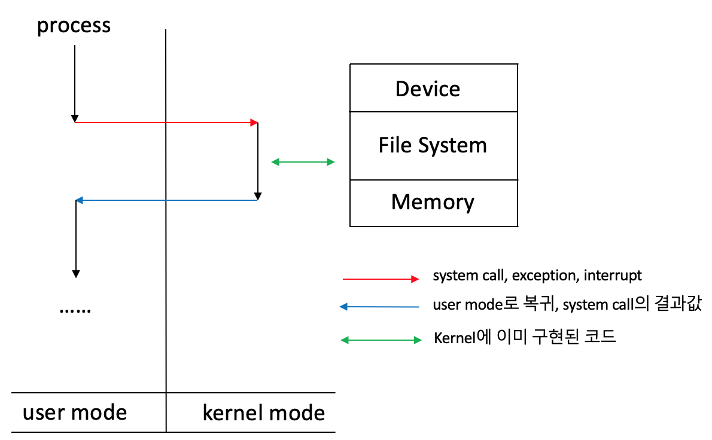

# OS 운영체제
수업 내용과 구글링 정보를 참고하여 작성하였습니다.
  
## 목차
[운영체제란?](#운영체제란?) 
  
## 운영체제란?
컴퓨터의 H/W와 S/W를 연결하여 통신과 작동을 가능하게하는 소프트웨어 프로그램 (중간매개체)
#### 컴퓨터의 구성 요소
① H/W &nbsp; ② **운영체제(OS)** &nbsp; ③ 응용 S/W &nbsp; ④ 사용자
#### 운영체제의 목적
* 처리 능력, 응답 시간, 신뢰도, 사용가능성을 최적화 시키기 위함
* 사용자에게 편리함을 위한 컴퓨터 제어
* 공정하고 효율적인 컴퓨터 자원 할당을 위함

#### 운영체제의 구조
 

**사용자 영역 vs. 커널 영역** 
다중 프로세스 환경에서의 <ins>하드웨어 보안</ins>을 위해 나뉘어진 영역으로써, 프로그램간의 충돌 및 방해를 억제하고 사용자의 하드웨어 접근을 제한하기 위함

* **사용자 영역(User Mode)**
  * 일반 사용자 프로그램이 실행되고 제한적인 명령만 수행할 수 있음
  * 모드 비트 1
* **커널 영역(Kernel Mode)**
  * 운영체제의 CPU제어 시 진입되는 영역이며, 모든 종류의 [명령](#명령)을 실행할 수 있음
  * 모드 비트 0

#### 운영체제의 역할
컴퓨터 자원(CPU 시간, 메모리 공간, 파일 저장공간, input/output, Network) 할당으로 프로그램 개발/실행을 위한 환경을 제공하고, 사용자의 프로그램을 관리하고 [오류](#오류) 방지를 위해 컴퓨터 제어 진행
**시스템 구성요소에 따른 OS의 역할**
* **[Process:](#Process와-Thread의-차이)** 실행중인 프로그램의 시스템 작업 단위
  * 프로그램은 여러 Process를 필요로 하는데, CPU 시간, 메모리 파일, I/O에 따라 처리 필요
  * 프로세스 관리: 프로세스 생성/제거, 중지, 재개, 동기화, 통신 역할
  * 교착상태 (deadlock) 처리
* **[주기억장치:](#기억장치)** CPU가 직접 접근하여 처리할 수 있고 현재 수행되는 프로그램과 데이터를 저장하는 고속 기억장치
  * 메모리 사용현황 관리, 할당, 회수
  * 프로세스 선택
* **파일:**
  * 파일이나 폴더 생성/삭제
  * 파일과 디렉토리를 조작하기 위한 연산작업
  * 보조기억장치와 파일간의 mapping
  * backup
* **I/O 장치**
  * 버퍼링, 캐싱 스풀링 등 기억관리 구성요소 제공
  * 장치 드라이버, 인터페이스 제공
* **보조기억장치**
  * 공간 관리 및 할당
  * disk scheduling

#### 오류방지

#### Thread
##### Process와 Thread의 차이
* **Process**
  * 