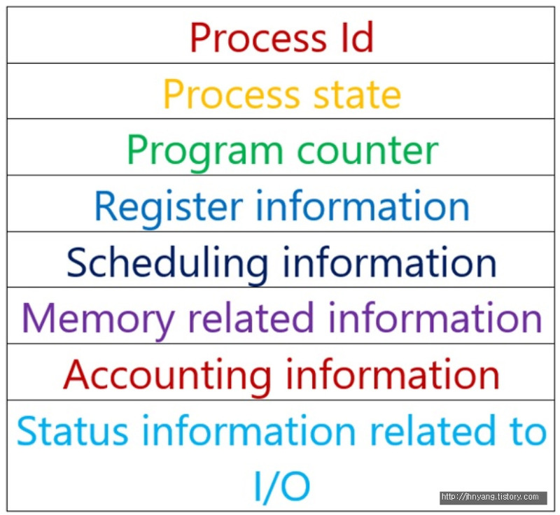
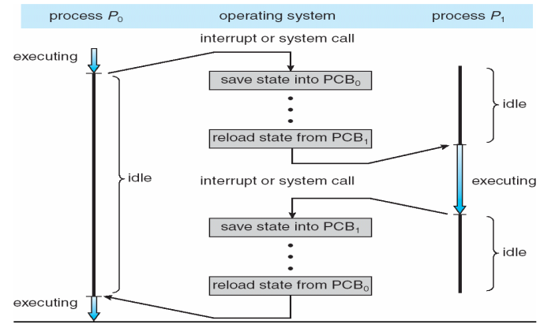
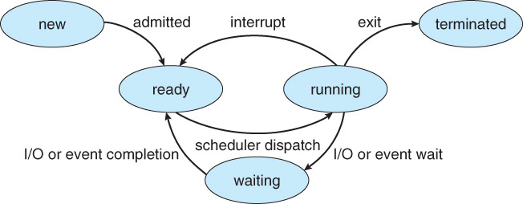
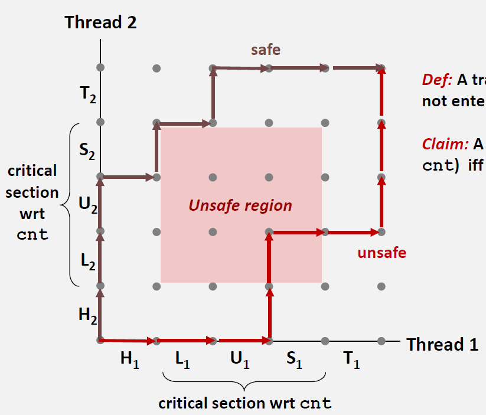

# OS 운영체제
수업 내용과 구글링 정보를 참고하여 작성하였습니다. 삽입한 그림은 현재는 모두 다른 웹사이트에서 불러왔으며 출처는 적지 않았으나 추후에 출처를 기입하거나 직접 그림을 올릴 예정입니다.
  
## 목차
[운영체제란?](#운영체제란?) 
[프로세스](#프로세스) 
[Thread](#Thread) 
[동기화](#동기화) 
[메모리](#메모리) 
[I/O 장치](#I/O-장치) 
  
## 운영체제란?
컴퓨터의 H/W와 S/W를 연결하여 통신과 작동을 가능하게하는 소프트웨어 프로그램 (중간매개체)
### 컴퓨터의 구성 요소
① H/W &nbsp; ② **운영체제(OS)** &nbsp; ③ 응용 S/W &nbsp; ④ 사용자
### 운영체제의 목적
* 처리 능력, 응답 시간, 신뢰도, 사용가능성을 최적화 시키기 위함
* 사용자에게 편리함을 위한 컴퓨터 제어
* 공정하고 효율적인 컴퓨터 자원 할당을 위함

### 운영체제의 구조
 

**사용자 영역 vs. 커널 영역** 
다중 프로세스 환경에서의 <ins>하드웨어 보안</ins>을 위해 나뉘어진 영역으로써, 프로그램간의 충돌 및 방해를 억제하고 사용자의 하드웨어 접근을 제한하기 위함

* **사용자 영역(User Mode)**
  * 일반 사용자 프로그램이 실행되고 제한적인 명령만 수행할 수 있음
  * 모드 비트 1
* **커널 영역(Kernel Mode)**
  * 운영체제의 CPU제어 시 진입되는 영역이며, 모든 종류의 [명령](#명령)을 실행할 수 있음
  * 모드 비트 0

### 운영체제의 역할
컴퓨터 자원(CPU 시간, 메모리 공간, 파일 저장공간, input/output, Network) 할당으로 프로그램 개발/실행을 위한 환경을 제공하고, 사용자의 프로그램을 관리하고 시스템 오류 방지를 위해 컴퓨터 제어 진행

**시스템 구성요소에 따른 OS의 역할**
* **[Process](#프로세스) 관리:** 실행중인 프로그램의 시스템 작업 단위
  * 프로그램은 여러 Process를 필요로 하는데, CPU 시간, 메모리 파일, I/O에 따라 처리 필요
  * 프로세스 관리: 프로세스 생성/제거, 중지, 재개, 동기화, 통신 역할
  * 교착상태 (deadlock) 처리
* **[주기억장치](#메모리) 관리:** CPU가 직접 접근하여 처리할 수 있고 현재 수행되는 프로그램과 데이터를 저장하는 고속 기억장치
  * 메모리 사용현황 관리, 할당, 회수
  * 프로세스 선택
* **[파일 시스템](#파일-시스템):**
  * 파일이나 폴더 생성/삭제
  * 파일과 디렉토리를 조작하기 위한 연산작업
  * 보조기억장치와 파일간의 mapping
  * backup
* **[I/O 장치](#I/O-장치)**
  * 입출력 인터럽트
  * 버퍼링, 캐싱, 스풀링 등 기억관리 구성요소 제공
  * 장치 드라이버, 인터페이스 제공
* **보조기억장치**
  * 공간 관리 및 할당
  * disk scheduling

### 멀티테스킹 시스템
**다중 프로그램 시스템**: 여러 프로그램을 동시에 실행하기 위해 메모리에 적재시키고, 하나의 프로그램이 대기상태가 되면 다음 프로그램을 실행
* [Scheduling](#Process-Scheduling)을 통해 사용자를 대신해 의사를 결정함
* 프로그램이 대기상태가 되면 다음 프로그램을 선택하여 CPU에 할당 (프로세스 하나씩 진행되지만 빨리 전환되어 멀티테스킹이 되는 것처럼 보임)
* CPU의 효율이 증가하지만, 여러 프로그램이 메모리에 동시에 존재하여 관리에 어려움이 있음
  

## 프로세스
컴퓨터에서 연속적으로 실행되고 있는 프로그램이며 디스크 메모리에 적재되어 OS로부터 시스템 자원을 할당 받음 
### 프로세스 구성 
 
* Stack: 지역 변수와 같이 일시적인 데이터 저장
* Heap: 코드에서 동적으로 생성되는 데이터 저장 (dynamically allocated memory)
* Data: 전역 변수나 static 변수 저장
* Text: 프로그램 코드 (current activity represented by the program counter)

### PCB (Process Control Block)
[Context Switching](#Context-Switching)에 사용되며 주기억장치에 저장되는 **프로세스 상태 정보 저장공간**으로, 프로세스가 생성될 때 PCB도 함께 생성됨 (각각의 프로세스마다 PCB 보유)

**구조**
 
* Process ID: Process의 고유 번호 (각 프로세스마다 다른 번호 보유)
* Process State: Process의 현재 상태
* Program counter: 다음에 실행될 명령어의 주소
* Register Information: Running상태에서 Ready로 변할 때, 현재 레지스터의 값 저장 (다시 running 상태로 변환될 때 필요)
* Scheduling Information: 우선 순위와 같은 scheduling에 필요한 정보
* Memory Releated Information: 주기억장치 관리에 필요한 정보 (e.g. 레지스터 값)
* Accounting Information: 통계 정보 (e.g. CPU running time)
* Status Information related to I/O: 입출력 장치 관련 정보, 파일 목록, ....
### Multi-Process 
하나의 프로그램에서 여러개의 process가 동시에 수행되고 각각 다른 task를 수행 (e.g. 크롬창 하나에서는 유튜브 재생, 다른 하나는 공부 블로그 실행)

**특징**
* 다른 child process가 죽어도 다른 process들에 영향을 끼치지 않음
* Context Switching할 때 overhead 발생
* 프로세스마다 다른 메모리를 할당 받았기 때문에 context switching이 발생하면 캐쉬를 초기화하고 캐쉬 정보를 다시 불러와야함 (비효율적) 

### Context Switching
실행 중인 상태의 Process를 보관하고 새로운 프로세스의 상태를 CPU에 적재시킴 (PCB 업데이트)
 
1. 프로세스 A 실행 중 [interrupt](#I/O-Interrupt)나 system call이 걸려 ready 상태로 변함 (A의 PCB에 상태 저장)
2. 다음 프로세스로 스케줄링된 프로세스 B의 PCB 정보를 불러옴
3. 프로세스 B 실행
4. 프로세스 B가 terminated되거나 interrupt/system call이 걸리면 B의 PCB정보를 저장하고 프로세스를 정지시킴
5. 스케줄링에 따라 다음 프로세스들 진행
6. 프로세스 A의 차례가 오면 다시 A의 PCB를 불러온 후 A 실행

### Process Control
**Child Process:** 프로세스 수행 중에 `folk()`를 통해 생성되는 process
* OS에서 직접 resource를 받거나 parent process를 통해 자원 획득 가능
* 자원이 한정되어있어 수많은 child processes를 낳을 수 없음
* Parent process와 병행으로 진행되며 부모 프로세스는 Child process가 완료될 때까지 `wait()`호출을 통해 기다림

**Process 종료 방식**
* **Child Process가 부모보다 먼저 종료되는 경우:**
  * 부모 Process가 `wait` system call을 호출하여 종료된 child processes를 제거함
  * 부모 Process가 종료될 때 함께 Process Table에서 제거됨
* **Zombie process:** Child process가 terminated 되어도 Parent process가 아직 수행 중인 경우 Child process는 Process Table에 남아 자원을 계속해서 소모함
* **Orphan process:** 자식 Process보다 Parent process가 먼저 종료되어 고아가 된 프로세스
  * 고아 프로세스의 부모를 `init`으로 설정하여 고아를 거두어줌 - Zombie child로 변함
  * `init`에서 주기적으로 `wait` system call을 하여 zombie process를 정리함
    * `init`: 부팅시 최초로 실행되는 프로세스
* **Cascading Termination:** 할당된 자원이 초과되거나 자식의 작업이 더이상 필요없을 경우 자식 프로세스를 강제 종료 시키는 것
  * 부모가 자식을 강제종료시킬 수 있음
  * 부모가 강제종료되면 자식도 함께 강제종료됨

### IPC(Inter-Process Communication)
각 프로세스는 자신만의 메모리가 존재하고 다른 프로세스의 접근으로부터 보호하기 때문에 IPC(Inter-Process Communication)를 통해서만 접근 가능
 
* **Shared memory(데이터 공유)**: 동일 시스템 내의 두 프로세서 간 공유하는 메모리를 만들고 이를 통해 프로세스끼리 데이터 공유
  * 메모리에 직접 접근하기 때문에 성능이 좋지만 A가 shared memory에 전달을 해도 B가 알 수 없는 [동기화](#동기화) 문제 발생 가능
* **Message Passing(메시지 전달)**: 동일 시스템 내의 두 프로세서 간 Kernel을 이용하여 resource를 전달하는 방식
  * 커널에서 데이터 송수신을 제어할 수 있어 안전하고 동기화가 가능하지만 커널에서 이루어지기 때문에 성능이 좋지 않음
  * **통신 방식(직접통신 vs. 간접통신)**
    * 직접 통신: 두 개의 프로세스 사이에서 통신이 이루어질 때 사용할 수 있는데, 송신자와 수신자의 이름(PID)이 정확히 제시되면 양방향 통신이 가능한 링크가 생성됨 (링크는 하나만 가능)
    * 간접 통신: 프로세스간에 공유되고있는 메일박스나 포트를 통해 전달되고 단방향/양방향의 링크가 생성됨 (두 프로세스 사이의 링크는 여러개 가능)  send(A, message) → mailbox → receive(A, message)
      * 여러 프로세스가 한 메일박스를 공유하고 있지만, 데이터 전달 진행시에는 한 프로세스에만 전달됨
* **Socket(소켓):** 다른 두 시스템간에 네트워크 소켓(IP주소와 포트번호 포함) 통신을 이용한 데이터 공유
  * Client-Server형태로 두 프로세스가 데이터 통신 진행

### 프로세스 상태
 
1. 사용자에 의해 새로운 Process가 생성되고 **ready** 상태가 됨
2. 스케줄러가 프로세서의 실행 시간을 설정(Scheduling)
3. 스케줄러에 의해 프로세서가 실행될 때가 오면 **running** 상태로 변환
4. 프로세스가 프로세서를 독점하지 못하도록 Timeout을 걸어 일정 시간이 지나면 interrupt가 걸려 다시 ready상태로 돌아가 다른 프로세서가 진행되도록 함
5. running 상태이고 interrupt가 걸리기 전, 입출력 연산이 필요하거나 자원이 필요할 경우 **waiting** 상태로 변환
6. waiting 상태에서 프로세스가 기다리던 작업이 끝나면 다시 **ready**상태로 돌아감
7. 프로세스의 모든 작업이 끝나면 프로세스가 **terminate**됨

### Process Scheduling
새로운 process가 생성되면 scheduler가 효율성을 위해 규칙에 따라 scheduling을 함(ready queue 스케줄링)

**Scheduling 발생 상황** 
① running→waiting &nbsp; ② running→ready &nbsp; ③ waiting→ready &nbsp; ④ running→terminated

**Scheduling 방식**
* **비선점** (①,④만 과정에 포함)
  * 프로세스가 CPU에 할당되어 실행하게 되면 프로세스가 종료되거나 대기중으로 변할 때까지 실행
  * FCFS(First-Come First-Served): 먼저 들어오는 프로세스가 먼저 실행되는 방식
  * SJF(Shortest Job First): 가장 실행시간이 짧은 프로세스가 우선 순위 점유
* **선점** (①~④ 모두 과정에 포함)
  * 프로세스가 실행 중이어도 특정 이벤트가 발생하면 중단시키고 다른 프로세스를 CPU에 할당
  * Priority Scheduling: 우선 순위가 높은 프로세스 먼저 실행
    * Starvation 문제: 우선 순위가 낮은 프로세스는 오랜 시간동안 실행되지 않는 문제 발생 (Aging으로 해결)
  * Round Robin: 각 프로세스마다 같은 time quantum을 설정하여 일정 시간이 지나면 다른 프로세서를 실행시키고 실행중이던 프로세스는 다시 ready queue로 적재
    * 공정한 스케줄링 방법으로, response time(실행할 때까지 기다리는 시간)이 빨라짐
    * Time quantum이 너무 짧으면 overhead가 길어지고, 너무 길면 FCFS와 같아지므로 효율적인 time quantum을 찾는 것이 중요

**Scheduling Queue 종류**
* **Job Queue:** 프로세스가 시스템에 처음 들어와서 대기하는 큐(ready queue가 수용하지 못할 때)
* **Ready Queue:** 주기억장치에 적재되어 실행을 기다리는 큐
* **Device Queue:** 각 장치마다 있으며 장치를 사용하기 위해 기다리는 큐
* **Waiting Queue:** 특정 이벤트 발생 시 이벤트가 완료될 때까지 기다리는 프로세스를 유지하는 큐
  

## Thread
*Thread와 Process의 차이를 물어볼 수 있음*
 
Process 내에서 발생하는 하나의 실행 단위(실행 흐름)이며, 한 Process 안에 여러 개의 thread 존재

**특징**
* Process와 Heap, Data, Code를 공유하고, 각 Thread마다 자신만의 Stack을 갖고 있음
* 각 Thread끼리는 Heap을 공유하지만 Process는 공유하지 않음
* 한 thread가 자원을 변경하면 다른 threads들에게도 영향이 끼침
* Thread 별로 PC Register을 갖고 있는데, 이는 Scheduling으로 인해 수행이 중간에 일시정지되는 경우 현재의 수행 상황을 저장하는데에 쓰임
  

### Multi-Thread
*Multi Process와 비교*
하나의 응용프로그램에서 여러 개의 Threads를 사용하여 각 Threads로 하여금 하나의 task 처리

**특징**
* Multi-Processing은 Multi-Threads를 기반으로 함
* 동시 작업 수행을 위해 Multi-Processing을 하는 것보다 자원/메모리 소모가 낮음
* Throughput 증가(=처리비용 감소)로 인해 작업량이 작고 cache 초기화가 불필요하여 context switching이 빠름
* stack을 제외한 모든 메모리를 공유하므로써 간단한 통신 방법으로 인한 시간 단축

**단점**
* 동기화 문제 발생 - 동기화에 신경써야함
* 하나의 thread에 문제가 생기면 전체 process에 영향을 끼침 - Critical Section 진입에 대해 신경써야함
  

## 동기화
여러 프로세스나 여러 Threads들이 동시에 진행 중일 때, 같은 자원에 접근하여 생기는 문제를 해결하기 위한 방법
### Critical Section (임계 영역)
여러 프로세스가 동시에 같은 자원에 접근하는 영역
 
(H: Head, L: Load, U: Update, S: Save, T: Tail) -- L,U,S가 Critical Section 생성
* Thread 1이 Critical Section에서 작업 중인 경우, 다른 Threads들은 접근할 수 없도록 해야함
* Thread 1이 Critical Section 진입 신청 후부터 받아들여질 때까지 다른 Threads들의 critical 진입 횟수를 제한해야함

### Race Condition
두 개 이상의 concurrent threads들이 자원에 동시에 접근하려는 상황 (e.g. 현금 출금 at the same time)

**발생 원인** 
* Kernel 작업 중 인터럽트가 발생하여 같은 데이터를 조작
  * Kernel 모드에서 수행하는 동안 인터럽트를 disable시켜 CPU 제어권을 얻지 못하도록하여 해결
* Process가 System call을 통해 커널 작업을 하는 도중 context switching이 일어날 때
  * e.g. P1이 커널모드에서 작업하는 도중, 시간 초과가 되어 CPU의 제어권이 P2로 넘어가 같은 데이터를 조작할 때 P2의 변화가 P1에 영향을 끼치지 않음
  * 시간 초과가 되어도 다른 CPU로 넘어가지 않도록 하여 해결
* Multi-Processors 환경에서 두 개의 CPU가 동시에 커널 내부의 공유 데이터에 접근 시
  * [Lock/Unlock](#Lock)으로 해결

### Lock
Mutex(= Binary [Semaphore](#세마포어))라고도 하며, Critical Section에 접근하는 thread에 lock을 걸어 다른 threads들이 접근 불가하도록 하고 수행 완료시 unlock
* 문제: 여러 process들이 동시에 critical section에 진입하는 경우가 발생할 수 있음

### 세마포어
Multi-Programming 환경에서 공유데이터 접근에 대해 제한하는 방법
* S: 자원 갯수(S>=0), P(S): 임계구역 진입 전 (S--), V(S): 임계구역에서 나올 때 자원 반납/대기중인 프로세스 깨움(S++)
* e.g. 프로세스의 S가 1이고, 임계구역을 진입하려는 Thread A&B
  1. A가 먼저 임계구역에 진입하려고 함 P(S) => S=0
  2. B가 도착하지만 S가 1이 아니므로 대기(`while`)
  3. A가 critical section에서 나옴 V(s) ==> S=1
  4. S=1이므로 자원이 충분하여 B가 대기상태에서 빠져나와 임계구역을 진입하고(P(S) ==> S=0), 수행 완료(V(S) ==> S=1)

### 교착 상태
Semaphore 수행 시 일어날 수 있는 문제

**과정** 
1. Process A가 자원 a를 얻고 Process B가 자원 b를 얻음. 이 때, a와 b에 `lock`이 걸림
2. A가 b를 얻고 싶지만 lock이 걸려있어 기다림
3. B가 a를 얻고 싶지만 lock이 걸려있어 기다림
4. 결국 둘다 얻을 수 없어 infinite loop(=**dead lock**)에 걸림

**발생 조건** 
네 가지 조건을 모두 충족해야 deadlock에 걸림
* **상호 배제(Mutual Exclusion):** 자원은 하나의 프로세스만 점유 가능
* **점유 대기(Hold & Wait):** 프로세스가 자원을 점유하고 있고, 다른 자원을 점유하려고 할 때 그 자원이 이미 다른 프로세스에 의해 점유되어있는 상황
* **비선점(Non-Preemptive):** 다른 프로세스에 이미 점유된 자원에 대한 수행이 끝날 때까지 자원 점유 불가능
* **순환 대기(Circular Wait):** 순환 형태로 자원 대기

**처리 방법** 
* **예방:** 네 가지 조건 중 하나라도 충족하지 않도록 함
* **회피:** 프로세스가 자원 요구 시, **은행원 알고리즘**으로 회피
  * 프로세스가 자원을 요구할 때, 자원 점유 시 문제가 없을 지를 먼저 파악하고 안전하면 자원 할당
* **회복:** 이미 deadlock이 발생했을 경우
  * 프로세스를 하나씩 종료
  * Deadlock에 걸린 프로세스를 일시정지시키고, 자원을 다른 프로세스에 할당

## 메모리
* Compiling 과정에서 linking 이후 실행 파일이 만들어지면 Loader이 메모리에 적재하고 OS가 메모리의 어느 부분에 저장할 지 결정함([MMU](#MMU)의 역할)
* 주소와 데이터로 이루어짐
* CPU에서 요청하는 데이터의 주소를 메모리로 보내면 메모리는 주소를 통해 데이터를 받아 CPU로 전해줌
* CPU에서의 계산 결과를 메모리의 특정 주소에 저장

### MMU(Memory Management Unit)
메모리 보호나 캐쉬관리 등 CPU가 메모리에 접근하는 것을 관리하는 H/W

**물리 주소:** MMU에서 CPU로 보내는 주소

**논리 주소:** CPU에서 MMU로 보내는 주소
* 논리 주소가 사용되려면 MMU를 사용하여 물리적 주소와 mapping 후 사용

**MMU의 역할** 
* CPU 코어 안에 탑재되어있으며 가상메모리를 실제 메모리로 변환시켜줌
* 메모리의 빈 공간을 찾아 주소의 영역을 정해주고 메모리 관리
* **Contiguous Allocation(연속 메모리 할당)**: 논리 주소가 연속이면 물리 주소도 연속. 즉, 프로세스 하나를 메모리에 분할하여 적재 불가능

### 단편화
프로세스들이 메모리에 적재되어있다가 제거되는 과정이 반복되면서 free space가 늘어나는 현상

**단편화 종류**
* **외부 단편화:** 부분적으로 있는 free space들을 합치면 충분한 공간이 있지만, 나뉘어져있어 할당 불가
* **내부 단편화:** 프로세스를 메모리에 적재했을때 남는 space가 충분하지 않은 경우 (e.g. 자유공간이 100GB있고 프로세스가 99GB이면 할당 후 1GB만 남음)

**Fitting**
* **First Fit:** 메모리를 처음부터 탐색해서 가장 빨리 찾아진 충분한 free space에 프로세스 적재
* **Best Fit:** 가급적 가장 잘 맞는 공간에 적재 -- 메모리 전체 search 필요
* **Worst Fit:** 가장 큰 남는 공간에 적재

### Paging
프로세스를 일정 단위로 나누어 메모리에 적재함으로써 외부 단편화
 
* 프로세스를 일정 크기의 page로 잘라서 메모리에 적재(연속적 메모리 할당 X)
* 논리 주소와 물리 주소를 같은 크기로 분배 후, 논리 메모리에 물리 메모리에 대한 정보 적재 (page mapping)
* 물리 메모리는 고정된 크기의 **Frames**로 나누고 논리 메모리는 Frame과 같은 크기의 **Pages**로 나눔
* 외부 단편화 문제는 해결되지만 내부 단편화 문제는 해결되지 않음

**가상 메모리(Virtual Memory)** 
* 프로세스 전체가 메모리에 적재되어있지 않아도 실행 가능하게 함 = 실제 메모리보다 프로그램이 커도 실행 가능
* 프로그램 실행 시, 필요한 프로세스만 주기억장치에 적재
  * 더 많은 프로그램을 동시에 실행 가능(응답시간 유지, CPU의 이용률&처리율 증가)
  * 실제 데이터에 접근하기 위해 MMU 사용
* System library가 여러 프로세스 사이에서 공유되도록 함

**Page Fault** 
* RAM상에 Page를 넣을 장소가 없을 때 발생
* RAM상에 찾고 있는 Page가 없을 때 발생

**Page 교체:** 프로세서가 주기억장치에 적재되어있지 않은 page에 접근할 때 발생
1. 접근하려는 page에 대해서 page table 탐색 - 적재되어있지 않으면 page fault trap 발생
2. 트랩 발생 시, PCB를 검사해서 유효성 검사 - 디스크에 있는 페이지에 대한 참조가 아닌 경우 process 종료
3. 빈 frame search 후 해당 page를 frame에 적재
4. 입출력 종료 후, process 내부 table과 page table 수정
5. trap이 발생했던 명령어를 재개하여 process 수행
* 페이징을 수행할 Frame이 없을 경우, page replacement 발생(기존 페이지를 new page로 교체)
* 페이지 교체 알고리즘
  * **FIFO(First-In First-Out):** 먼저 들어온 page가 희생
  * **OPT(OPTimal):** 가장 오래 사용되지 않은 page가 희생
  * **LRU(Least Recently Used):** 가장 오래전에 참조한 page가 희생 -- 가장 널리 사용됨
  * **LFU(Least Frequently Used):** 가장 참조 횟수가 적은 page가 희생

**Page replacement**
* 빈 frame이 없는 상태에서 victim page를 비울 때와 원하는 page를 frame으로 올리는 과정에서 2번 overhead 발생
* 최소한의 page replacement 필요 -> 상황에 따른 최적의 algorithm 선택이 중요

### 메모리 낭비 방지
**로딩:** 프로그램(실행파일)을 메모리에 적재시키는 것 
**부팅:** OS를 메모리에 적재시키는 것

**동적 적재(Dynamic Loading):** 모든 동작을 메모리에 적재 시키면 차지하는 공간이 많아져 문제가 생길 수 있기 때문에, 프로그램에 필요한 실제 사용되는 루틴/데이터만 메모리에 적재하는 것

**동적 연결(Dynamic Linking):** 여러 프로그램에 공통적으로 자주 사용되는 라이브러리(e.g. `<iostream>`)를 각각 메모리에 적재하게 될 경우 메모리 낭비가 생김. 따라서, 하나의 라이브러리 루틴(library routine)만 메모리에 적재.
실행파일을 만들 때 link를 생성하는 것이 아니라 실행할 때 생성하고 다른 프로그램 실행 시 이 루틴과 연결됨.

**Swapping:** 메모리에 적재되어있지만 사용하지 않는 프로세스를 보조기억장치로 옮긴 후(**Swap-out**), 이 후에 다시 주기억장치에 적재(**Swap-in**)하여 실행 재개. 프로세스가 들어갈 공간이 없을 때 사용되며, 보조기억장치를 사용하기 때문에 context switching 시간이 오래 걸림.

### Cache
주기억장치에 저장된 내용의 일부를 임시로 저장해주는 장치이며, 메인 메모리에 직접 접근하는 것은 비효율적이므로 CPU와 메인 메모리의 속도를 맞추기 위해 사용 
Hit/Miss를 사용해서 관리 
**지역성의 원리:** 적중률(Hit rate)를 극대화 시키기 위한 방법
  * 시간 지역성: 최근에 참조된 주소의 내용은 곧 다시 참조됨
  * 공간 지역성: 실제 프로그램이 창조된 주소와 인접한 주소의 내용이 다시 참조됨

**Caching Line:** Set이나 map을 이용해서 필요 데이터에 바로 접근하도록 함(전체를 search 하는 것은 비효율적)
  

## I/O 장치
### 입출력 시스템의 구성
* 입출력 장치는 장치 제어기와 연결되는데 장치 제어기는 시스템 버스와 연결되어있음
* 응용 프로그램이 시스템 콜을 호출하면 커널의 디바이스 드라이버에게 전달되고 하드웨어인 장치제어기와 명령 및 정보를 주고 받으며 작업을 수행하면서 입출력 장치가 통제됨

### 입출력 방식
**직접 입출력 방식** 
* CPU가 직접 주관하여 입출력을 수행하는 방식으로 효율적이지 못함
* 폴링과 인터럽트 방식이 있음

**간접 입출력 방식** 
* CPU가 직접 주관하지 않고 [DMA](#DMA(Direct-Memory-Access))나 입출력 채널에게 정보를 넘겨 처리하는 방식
* 다중 프로그램을 이용할 때 쓰임
* 처리 방법
  1. CPU에게 정보 전달
  2. CPU는 입출력 프로세서에게 입출력 명령 수행을 위임하고 이때, CPU는 작업을 중단하지 않고 다른 프로그램 수행
  3. 입출력 프로세서로부터 입출력 완료 신호가 인터럽트 방식으로 CPU에게 보고
  4. CPU는 현재 수행 중인 프로그램을 잠시 중단하고 입출력이 발생했던 최초의 프로그램 수행을 다시 재개하여 먼저 처리해줌

### I/O Interrupt
**과정**
1. I/O를 시작하기 위해 CPU가 장치제어기 내에 있는 register에 적절한 데이터 적재
2. 어떤 action을 취할지 파악/결정
3. 수행이 끝나면 interrupt를 통해 CPU에 알림

**입출력 형태** 
* 동기식 입출력: 입출력이 시작되면 완료될 때까지 기다림
* 비동기식 입출력: 입출력이 시작되어도 진행 중이던 작업 계속 수행

### DMA(Direct Memory Access)
CPU를 대신하여 I/O장치와 메모리 사이의 데이터 전송을 담당하는 장치

**특징** 
* source와 destination, 전송할 바이트 수만 주어지면 알아서 data를 전송해주고 Processor가 신경쓰지 않아도 됨
* 모든 전송이 끝나면 H/W interrupt로 CPU에 완료 보고를 함
* 프로그램 수행 중 인터럽트의 발생 횟수를 최소화하여 컴퓨터의 효율을 높임
* CPU는 DMA와 상태 정보 및 제어 정보만 주고 받음

**동작 과정**
1. 주변 장치가 DMA 요청하고 DMA에서 CPU 인터럽트 발생
2. CPU는 인터럽트를 받아 입출력 정보를 데이터 버스를 통해 보냄
3. DMA는 주변 장치에 ACK를 보냄
4. ACK를 받은 주변 장치는 데이터 버스를 통해 데이터 전송
5. CPU와 DMA가 동시에 버스를 사용하고자 하는 경우, 속도가 빠른 CPU가 DMA에게 한 메모리 사이클 동안 버스 사용권을 먼저 줌 (cycle stealing)

### 입출력 버퍼링
버퍼링은 한 작업의 연상과 함께 입출력을 동시에 수행하는 방법으로 CPU와 입출력장치 간의 속도차이를 줄이기 위한 방식 
버퍼를 통해 데이터를 미리 읽어놓은 후 필요할 때마다 사용하므로써 효율성 높이는 방식

**과정** 
1. I/O 장치로 데이터 입력 후, CPU가 연산하려고 하는 순간 입력 장치가 다음 입력을 시작
2. 입력 버퍼링이 프로세스가 데이터를 요구하기 전에 입력 장치의 데이터를 주기억장치(버퍼)에 복사
### Spooling
디스크를 매우 큰 버퍼처럼 사용하여 다수의 프로세스들이 입출력 장치를 서로 요구하나 실제로 그 장치의 수가 제한되어 있을 때 공유를 위해 가상 장치를 각 프로세스에 제공 
출력 장치로 갈 데이터를 보조기억장치에 잠깐 기억시켰다가 CPU가 다른 일을 처리하면서 사이사이에 조금씩 출력장치로 보내주어 정체 작업의 효율을 향상시키는 방식