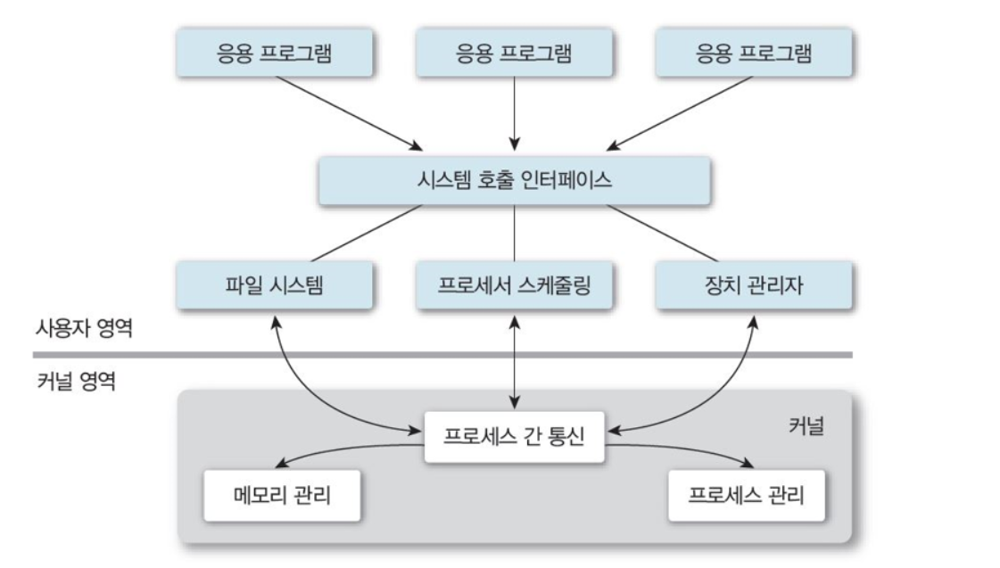

# OS 운영체제
수업 내용과 구글링 정보를 참고하여 작성하였습니다.
  
## 목차
[운영체제란?](#운영체제란?) 
[프로세스](#프로세스) 
[동기화(Syncronization)](#동기화(Syncronization)) 
  
## 운영체제란?
컴퓨터의 H/W와 S/W를 연결하여 통신과 작동을 가능하게하는 소프트웨어 프로그램 (중간매개체)
#### 컴퓨터의 구성 요소
① H/W &nbsp; ② **운영체제(OS)** &nbsp; ③ 응용 S/W &nbsp; ④ 사용자
#### 운영체제의 목적
* 처리 능력, 응답 시간, 신뢰도, 사용가능성을 최적화 시키기 위함
* 사용자에게 편리함을 위한 컴퓨터 제어
* 공정하고 효율적인 컴퓨터 자원 할당을 위함

#### 운영체제의 구조
 

**사용자 영역 vs. 커널 영역** 
다중 프로세스 환경에서의 <ins>하드웨어 보안</ins>을 위해 나뉘어진 영역으로써, 프로그램간의 충돌 및 방해를 억제하고 사용자의 하드웨어 접근을 제한하기 위함

* **사용자 영역(User Mode)**
  * 일반 사용자 프로그램이 실행되고 제한적인 명령만 수행할 수 있음
  * 모드 비트 1
* **커널 영역(Kernel Mode)**
  * 운영체제의 CPU제어 시 진입되는 영역이며, 모든 종류의 [명령](#명령)을 실행할 수 있음
  * 모드 비트 0

#### 운영체제의 역할
컴퓨터 자원(CPU 시간, 메모리 공간, 파일 저장공간, input/output, Network) 할당으로 프로그램 개발/실행을 위한 환경을 제공하고, 사용자의 프로그램을 관리하고 [오류](#오류) 방지를 위해 컴퓨터 제어 진행
**시스템 구성요소에 따른 OS의 역할**
* **[Process:](#Process)** 실행중인 프로그램의 시스템 작업 단위
  * 프로그램은 여러 Process를 필요로 하는데, CPU 시간, 메모리 파일, I/O에 따라 처리 필요
  * 프로세스 관리: 프로세스 생성/제거, 중지, 재개, 동기화, 통신 역할
  * 교착상태 (deadlock) 처리
* **[주기억장치:](#기억장치)** CPU가 직접 접근하여 처리할 수 있고 현재 수행되는 프로그램과 데이터를 저장하는 고속 기억장치
  * 메모리 사용현황 관리, 할당, 회수
  * 프로세스 선택
* **파일:**
  * 파일이나 폴더 생성/삭제
  * 파일과 디렉토리를 조작하기 위한 연산작업
  * 보조기억장치와 파일간의 mapping
  * backup
* **I/O 장치**
  * 버퍼링, 캐싱 스풀링 등 기억관리 구성요소 제공
  * 장치 드라이버, 인터페이스 제공
* **보조기억장치**
  * 공간 관리 및 할당
  * disk scheduling

#### 오류방지

## 프로세스
컴퓨터에서 연속적으로 실행되고 있는 프로그램이며 디스크 메모리에 적재되어 OS로부터 시스템 자원을 할당 받음 
#### 프로세스 구성 
 
* Stack: 지역 변수와 같이 일시적인 데이터 저장
* Heap: 코드에서 동적으로 생성되는 데이터 저장 (dynamically allocated memory)
* Data: 전역 변수나 static 변수 저장
* Text: 프로그램 코드 (current activity represented by the program counter)
#### IPC(Inter-Process Communication)
각 프로세스는 자신만의 메모리가 존재하고 다른 프로세스의 접근으로부터 보호하기 때문에 IPC(Inter-Process Communication)를 통해서만 접근 가능
 
* **Shared memory(데이터 공유)**: 두 프로세서 간 공유하는 메모리를 만들고 이를 통해 프로세스끼리 데이터 공유
  * 메모리에 직접 접근하기 때문에 성능이 좋지만 A가 shared memory에 전달을 해도 B가 알 수 없는 [동기화](#동기화(Syncronization)) 문제 발생 가능
* **Message Passing(메시지 전달)**: Kernel을 이용하여 resource를 전달하는 방식
  * 커널에서 데이터 송수신을 제어할 수 있어 안전하고 동기화가 가능하지만 커널에서 이루어지기 때문에 성능이 좋지 않음
  * **통신 방식(직접통신 vs. 간접통신)**
    * 직접 통신: 두 개의 프로세스 사이에서 통신이 이루어질 때 사용할 수 있는데, 송신자와 수신자의 이름(PID)이 정확히 제시되면 양방향 통신이 가능한 링크가 생성됨 (링크는 하나만 가능)
    * 간접 통신: 프로세스간에 공유되고있는 메일박스나 포트를 통해 전달되고 단방향/양방향의 링크가 생성됨 (두 프로세스 사이의 링크는 여러개 가능)  send(A, message) → mailbox → receive(A, message)
      * 여러 프로세스가 한 메일박스를 공유하고 있지만, 데이터 전달 진행시에는 한 프로세스에만 전달됨
#### 프로세스 상태
 

## 동기화(Syncronization)